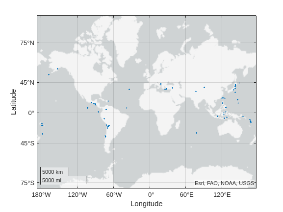

# Earthquake

 Analyze earthquake

<a name="beginToc"></a>

## Table of Contents
[Resources](#resources)
 
[Set up environment](#set-up-environment)
 
[Import data](#import-data)
 
[Export to ipynb and md](#export-to-ipynb-and-md)
 
<a name="endToc"></a>

# Resources
-   [https://github.com/yanndebray/matlab\-with\-python\-book](https://github.com/yanndebray/matlab-with-python-book) 
-  [https://www.mathworks.com/videos/large\-data\-in\-matlab\-a\-seismic\-data\-processing\-case\-study\-81792.html](https://www.mathworks.com/videos/large-data-in-matlab-a-seismic-data-processing-case-study-81792.html)  
-  [https://www.mathworks.com/help/matlab/matlab\_prog/loma\-prieta\-earthquake.html](https://www.mathworks.com/help/matlab/matlab_prog/loma-prieta-earthquake.html)  

# Set up environment
```matlab
setup
```

```matlabTextOutput
Warning: Name is nonexistent or not a directory: /MATLAB Drive/earthquake/pip
Defaulting to user installation because normal site-packages is not writeable
Requirement already satisfied: requests in /home/matlab/.local/lib/python3.10/site-packages (2.31.0)
Requirement already satisfied: pandas in /home/matlab/.local/lib/python3.10/site-packages (2.2.1)
Requirement already satisfied: charset-normalizer<4,>=2 in /home/matlab/.local/lib/python3.10/site-packages (from requests) (3.3.2)
Requirement already satisfied: idna<4,>=2.5 in /home/matlab/.local/lib/python3.10/site-packages (from requests) (3.6)
Requirement already satisfied: urllib3<3,>=1.21.1 in /home/matlab/.local/lib/python3.10/site-packages (from requests) (2.2.1)
Requirement already satisfied: certifi>=2017.4.17 in /home/matlab/.local/lib/python3.10/site-packages (from requests) (2024.2.2)
Requirement already satisfied: numpy<2,>=1.22.4 in /home/matlab/.local/lib/python3.10/site-packages (from pandas) (1.26.4)
Requirement already satisfied: python-dateutil>=2.8.2 in /home/matlab/.local/lib/python3.10/site-packages (from pandas) (2.9.0.post0)
Requirement already satisfied: pytz>=2020.1 in /home/matlab/.local/lib/python3.10/site-packages (from pandas) (2024.1)
Requirement already satisfied: tzdata>=2022.7 in /home/matlab/.local/lib/python3.10/site-packages (from pandas) (2024.1)
Requirement already satisfied: six>=1.5 in /usr/lib/python3/dist-packages (from python-dateutil>=2.8.2->pandas) (1.16.0)
```

```matlab
piplist
```

```matlabTextOutput
Package             Version
------------------- -------------
apparmor            3.0.4
blinker             1.4
certifi             2024.2.2
charset-normalizer  3.3.2
cryptography        3.4.8
dbus-python         1.2.18
distro              1.7.0
distro-info         1.1+ubuntu0.2
httplib2            0.20.2
idna                3.6
importlib-metadata  4.6.4
jeepney             0.7.1
keyring             23.5.0
launchpadlib        1.10.16
lazr.restfulclient  0.14.4
lazr.uri            1.0.6
LibAppArmor         3.0.4
more-itertools      8.10.0
numpy               1.26.4
oauthlib            3.2.0
pandas              2.2.1
PyGObject           3.42.1
PyJWT               2.3.0
pyparsing           2.4.7
python-apt          2.4.0+ubuntu3
python-dateutil     2.9.0.post0
pytz                2024.1
PyYAML              5.4.1
requests            2.31.0
SecretStorage       3.3.1
six                 1.16.0
systemd-python      234
tzdata              2024.1
unattended-upgrades 0.1
urllib3             2.2.1
wadllib             1.3.6
zipp                1.0.0
```

# Import data
```matlab
% Python code input
pycode2 = [...
"import requests",...
"import pandas as pd",...
"",...
"# Function to fetch earthquake data from USGS API",...
"def fetch_earthquake_data(start_date, end_date):",...
"    url = f""https://earthquake.usgs.gov/fdsnws/event/1/query?format=geojson&starttime={start_date}&endtime={end_date}&minmagnitude=4""",...
"    response = requests.get(url)",...
"    data = response.json()",...
"    return data['features']",...
"",...
"# Example: Analyzing earthquake data from April 2024",...
"start_date = ""2024-04-01""",...
"end_date = ""2024-04-05""",...
"earthquake_data = fetch_earthquake_data(start_date, end_date)",...
"",...
"# Convert data to DataFrame for easier manipulation",...
"earthquake_df = pd.DataFrame(earthquake_data)",...
"",...
"# Extracting relevant information",...
"earthquake_df['magnitude'] = earthquake_df['properties'].apply(lambda x: x['mag'])",...
"earthquake_df['location'] = earthquake_df['properties'].apply(lambda x: x['place'])",...
"# earthquake_df['time'] = earthquake_df['properties'].apply(lambda x: x['time']) # Unix timestamp",...
"earthquake_df['time'] = pd.to_datetime(earthquake_df['properties'].apply(lambda x: x['time']), unit='ms') # Convert to datetime",...
"",...
"# Convert geometry to separate columns",...
"earthquake_df['longitude'] = earthquake_df['geometry'].apply(lambda x: x['coordinates'][0])",...
"earthquake_df['latitude'] = earthquake_df['geometry'].apply(lambda x: x['coordinates'][1])",...
"earthquake_df['depth'] = earthquake_df['geometry'].apply(lambda x: x['coordinates'][2])"...
];

[start_date, end_date, earthquake_data, earthquake_df] = pyrun(pycode2, ...
     [ "start_date" "end_date" "earthquake_data" "earthquake_df" ])
```

```matlabTextOutput
start_date = 
  Python str with no properties.

    2024-04-01

end_date = 
  Python str with no properties.

    2024-04-05

earthquake_data = 
  Python list with values:

earthquake_df = 
  Python DataFrame with properties:

          T: [1x1 py.pandas.core.frame.DataFrame]
         at: [1x1 py.pandas.core.indexing._AtIndexer]
      attrs: [1x1 py.dict]
       axes: [1x2 py.list]
    columns: [1x1 py.pandas.core.indexes.base.Index]
     dtypes: [1x1 py.pandas.core.series.Series]
      empty: 0
      flags: [1x1 py.pandas.core.flags.Flags]
        iat: [1x1 py.pandas.core.indexing._iAtIndexer]
       iloc: [1x1 py.pandas.core.indexing._iLocIndexer]
      index: [1x1 py.pandas.core.indexes.range.RangeIndex]
        loc: [1x1 py.pandas.core.indexing._LocIndexer]
       ndim: [1x1 py.int]
      shape: [1x2 py.tuple]
       size: [1x1 py.int]
     values: [1x1 py.numpy.ndarray]

            type  ...    depth
    0    Feature  ...   10.000
    1    Feature  ...   10.000
    2    Feature  ...   10.000
    3    Feature  ...   10.000
    4    Feature  ...   10.000
    ..       ...  ...      ...
    112  Feature  ...   57.800
    113  Feature  ...  112.480
    114  Feature  ...  134.902
    115  Feature  ...   10.000
    116  Feature  ...  149.740
    
    [117 rows x 10 columns]

```

```matlab

% Clean up
clear pycode2;
```

```matlab
T = table(earthquake_df);
T = removevars(T,{'type','geometry','properties'})
```
| |id|magnitude|location|time|longitude|latitude|depth|
|:--:|:--:|:--:|:--:|:--:|:--:|:--:|:--:|
|1|"us7000m9zx"|5.1000|"central Mid-Atlantic Ridge"|04-Apr-2024 23:46:41|-38.1466|7.9214|10|
|2|"us7000m9zu"|5|"central Mid-Atlantic Ridge"|04-Apr-2024 23:43:54|-38.1232|7.8883|10|
|3|"us7000m9zr"|5.2000|"central Mid-Atlantic Ridge"|04-Apr-2024 23:37:29|-38.1518|7.9378|10|
|4|"us7000m9zn"|5|"central Mid-Atlantic Ridge"|04-Apr-2024 23:18:24|-38.2188|8.0644|10|
|5|"us7000m9zm"|5|"central Mid-Atlantic Ridge"|04-Apr-2024 23:16:56|-38.0892|7.9724|10|
|6|"us7000m9z0"|5|"35 km SW of Urakawa, Japan"|04-Apr-2024 20:31:49|142.4691|41.9425|62.9880|
|7|"us7000m9yq"|4.4000|"72 km SW of Unalaska, Alaska"|04-Apr-2024 19:57:02|-167.3555|53.4389|89.7760|
|8|"us7000m9yk"|4.9000|"Mariana Islands region"|04-Apr-2024 19:29:07|145.6787|21.0849|35|
|9|"us7000m9yf"|4.5000|"47 km NE of Hualien City, Taiwan"|04-Apr-2024 18:42:36|121.9331|24.2815|21.0220|
|10|"us7000m9yb"|4.9000|"21 km NNE of Hualien City, Taiwan"|04-Apr-2024 18:35:02|121.6902|24.1565|36.6620|
|11|"us7000m9y8"|4.7000|"134 km NW of Ternate, Indonesia"|04-Apr-2024 18:29:27|126.4129|1.5168|54.4810|
|12|"us7000m9xz"|4.4000|"32 km NNE of Hualien City, Taiwan"|04-Apr-2024 17:24:51|121.7473|24.2376|20.7550|
|13|"us7000m9w5"|5.2000|"34 km S of Padam, India"|04-Apr-2024 16:04:31|76.8274|33.1567|21.3350|
|14|"us7000m9vn"|4.9000|"33 km NNE of Hualien City, Taiwan"|04-Apr-2024 14:30:06|121.7875|24.2289|17.5820|

```matlab
head(T)
```

```matlabTextOutput
         id         magnitude               location                       time            longitude    latitude    depth 
    ____________    _________    ______________________________    ____________________    _________    ________    ______

    "us7000m9zx"       5.1       "central Mid-Atlantic Ridge"      04-Apr-2024 23:46:41     -38.147      7.9214         10
    "us7000m9zu"         5       "central Mid-Atlantic Ridge"      04-Apr-2024 23:43:54     -38.123      7.8883         10
    "us7000m9zr"       5.2       "central Mid-Atlantic Ridge"      04-Apr-2024 23:37:29     -38.152      7.9378         10
    "us7000m9zn"         5       "central Mid-Atlantic Ridge"      04-Apr-2024 23:18:24     -38.219      8.0644         10
    "us7000m9zm"         5       "central Mid-Atlantic Ridge"      04-Apr-2024 23:16:56     -38.089      7.9724         10
    "us7000m9z0"         5       "35 km SW of Urakawa, Japan"      04-Apr-2024 20:31:49      142.47      41.943     62.988
    "us7000m9yq"       4.4       "72 km SW of Unalaska, Alaska"    04-Apr-2024 19:57:02     -167.36      53.439     89.776
    "us7000m9yk"       4.9       "Mariana Islands region"          04-Apr-2024 19:29:07      145.68      21.085         35
```

```matlab
unique(T.location)
```

```matlabTextOutput
ans = 104x1 string    
"10 km ESE of Hualien City, Ta…  
"10 km SSW of Hualien City, Ta…  
"103 km SSW of Uyuni, Bolivia"   
"108 km N of Paciran, Indonesia" 
"11 km E of Hualien City, Taiwan"
"11 km N of Yopal, Colombia"     
"11 km NE of Hualien City, Tai…  
"114 km SSE of Kuril’sk, Russia" 
"117 km NE of Kendari, Indonesia"
"117 km WNW of Puerto, Chile"    

```

```matlab
filtered_data = T(T.magnitude >= 4 & T.magnitude <= 5, :);
head(filtered_data)
```

```matlabTextOutput
         id         magnitude                 location                          time            longitude    latitude    depth 
    ____________    _________    ___________________________________    ____________________    _________    ________    ______

    "us7000m9zu"         5       "central Mid-Atlantic Ridge"           04-Apr-2024 23:43:54     -38.123      7.8883         10
    "us7000m9zn"         5       "central Mid-Atlantic Ridge"           04-Apr-2024 23:18:24     -38.219      8.0644         10
    "us7000m9zm"         5       "central Mid-Atlantic Ridge"           04-Apr-2024 23:16:56     -38.089      7.9724         10
    "us7000m9z0"         5       "35 km SW of Urakawa, Japan"           04-Apr-2024 20:31:49      142.47      41.943     62.988
    "us7000m9yq"       4.4       "72 km SW of Unalaska, Alaska"         04-Apr-2024 19:57:02     -167.36      53.439     89.776
    "us7000m9yk"       4.9       "Mariana Islands region"               04-Apr-2024 19:29:07      145.68      21.085         35
    "us7000m9yf"       4.5       "47 km NE of Hualien City, Taiwan"     04-Apr-2024 18:42:36      121.93      24.282     21.022
    "us7000m9yb"       4.9       "21 km NNE of Hualien City, Taiwan"    04-Apr-2024 18:35:02      121.69      24.157     36.662
```

```matlab
geoscatter(T.latitude,T.longitude,T.magnitude,"filled")
```



# Export to ipynb and md
```matlab
export('livescript.mlx','README.md');
```

```matlabTextOutput
ans = '/MATLAB Drive/earthquake/README.md'
```

```matlab
export('')
```
